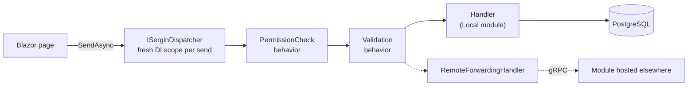
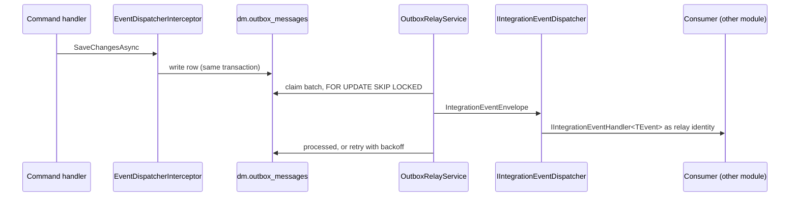

# Sergin Meter Minder

**A head-end system for smart electricity, gas and water meters — built as a .NET 10 modular monolith, with a Blazor Server front end, PostgreSQL underneath and Keycloak at the door.**

[](https://dotnet.microsoft.com/)
[](src/Hosts/Sergin.MeterMinder.Hosts.All)
[](docker-compose/docker-compose.yml)
[](docker-compose/.files/identity/sergin-realm.json)
[](LICENSE)

Meter Minder is the hostable root of the **Sergin** platform. One process composes two modules: **DeviceManagement** (`dm`), the head-end system that owns devices and manufacturers, and **UserAccess** (`ua`), which owns users, roles and the permission set everything else authorizes against. Each module is a Clean Architecture stack with its own PostgreSQL schema, its own migrations and its own Razor pages. The host is a twenty-line `Program.cs` that hands both to a shared bootstrap.

## At a glance

| | |
|---|---|
| **Runtime** | .NET 10. Warnings are errors: `AnalysisMode=All`, SonarAnalyzer, `EnforceCodeStyleInBuild`. |
| **Front end** | Blazor Server + MudBlazor. One Razor Class Library per module; pages dispatch to handlers in-process through MediatR. |
| **Storage** | PostgreSQL 17, one schema per module. EF Core on the write side, Dapper and raw SQL on the read side. |
| **Sign-in** | Keycloak over OpenID Connect. Keycloak authenticates; Sergin authorizes. A configuration-only `DevUser` mode for day-to-day local work. |
| **Messaging** | Domain events dispatched inside the saving transaction; a transactional outbox with inbox dedup, a background relay and a pluggable transport seam. |
| **Observability** | .NET Aspire service defaults (OpenTelemetry, health checks, resilience) and the Aspire dashboard container. |
| **Tests** | One xUnit integration project driving the real host against a disposable `postgres:17` from Testcontainers. |

## Three repositories, one working tree

This is the root of a three-repo split. Two directories are git submodules that point at their own repositories; every `ProjectReference` resolves because they are mounted at the same relative paths they occupied before the split.

| Path | Repository | What it holds |
|---|---|---|
| `.` | [Sergin.MeterMinder](https://github.com/poursh/Sergin.MeterMinder) | The host, the DeviceManagement module, the integration tests, Docker Compose |
| `src/SharedKernel/` | [Sergin.SharedKernel](https://github.com/poursh/Sergin.SharedKernel) | Framework building blocks and host bootstraps. Builds standalone; depends on nothing else. |
| `src/Modules/UserAccess/` | [Sergin.UserAccess](https://github.com/poursh/Sergin.UserAccess) | The UserAccess module. Embed-only: it compiles only when mounted here. |

> [!IMPORTANT]
> Clone with `--recurse-submodules`, or run `git submodule update --init --recursive` afterwards — a plain clone leaves both directories empty and the build fails on unresolvable project references. A commit made inside either directory belongs to that submodule's repository, not to this one.

```
.
├── src/
│   ├── Hosts/Sergin.MeterMinder.Hosts.All/     Blazor Server host — the only runnable project
│   ├── Modules/
│   │   ├── DeviceManagement/                    schema dm — Devices, Manufacturers
│   │   └── UserAccess/                          schema ua — Users, Roles          (submodule)
│   └── SharedKernel/                            building blocks, bootstraps        (submodule)
├── tests/Sergin.MeterMinder.IntegrationTests.All/
├── docker-compose/                              app + postgres:17 + Keycloak + Aspire dashboard
└── docs/superpowers/                            design specs and implementation plans
```

## Quick start

Requires the **.NET 10 SDK** (Visual Studio 17.13+ or Rider). Run every command from the repository root.

```bash
git clone --recurse-submodules https://github.com/poursh/Sergin.MeterMinder.git
cd Sergin.MeterMinder
dotnet build Sergin.MeterMinder.slnx
```

### Run it on your machine

`dotnet run` starts the host in `DevUser` mode: no sign-in, every request runs as the user configured under `Sergin:DevUser`, and the Development environment applies EF migrations on startup. It needs a PostgreSQL instance and a connection string, which is never committed — give it one as a user secret:

```bash
dotnet user-secrets set "Sergin:ConnectionStrings:Database" \
  "Host=localhost;Port=5432;Database=Sergin_DB;Username=postgres;Password=<yours>" \
  --project src/Hosts/Sergin.MeterMinder.Hosts.All

dotnet run --project src/Hosts/Sergin.MeterMinder.Hosts.All
# → http://localhost:5002
```

### Run the whole stack in Docker

Compose builds the app image and starts PostgreSQL, Keycloak and the Aspire dashboard next to it. This stack runs in `Keycloak` mode, so you sign in for real — the realm export seeds a user **`dev`** with password **`dev`**. Submodules must be initialized first; the build context copies the whole working tree.

```bash
docker compose -f docker-compose/docker-compose.yml up --build
```

| Port | Service |
|---|---|
| `5002` / `5003` | Blazor host, http / https |
| `5432` | PostgreSQL |
| `8080` | Keycloak (admin console: `admin` / `admin`, development only) |
| `18888` | Aspire dashboard |
| `4317` | OTLP ingest, mapped to the dashboard container's `18889` |

The same ports apply to `dotnet run` (`launchSettings.json`) and to Compose (`docker-compose.yml`).

In **Visual Studio**, open `Sergin.MeterMinder.slnx`, set `docker-compose` (`docker-compose/docker-compose.dcproj`) as the startup project and press F5 — it builds the images, starts the stack and attaches the debugger.

## Signing in

`Sergin:Auth:Mode` decides whether authentication is on at all.

| Mode | What happens | Where it is used |
|---|---|---|
| `DevUser` (default) | No authentication. Every request runs as `Sergin:DevUser`, which ships with the three read permissions the UI exercises. **Development only** — the host refuses to start in any other environment rather than serve unauthenticated pages. | `dotnet run` |
| `Keycloak` | OpenID Connect against the `sergin` realm. During the callback, UserAccess finds or creates the user by the provider's `sub`, gives a new user the seeded `viewer` role, and hands back that user's permissions, which are stamped into the auth cookie as claims. A permission check then reads claims only — no database work — at the price that a change to someone's rights takes effect at their next sign-in. | Docker Compose |

Keycloak authenticates; **Sergin authorizes**. The realm grants no permissions. Role administration has no UI yet — the migration seeds `administrator` and `viewer`, and changing who holds which role means editing `ua.user_roles` directly.

> [!NOTE]
> **`Authority` and `MetadataAddress` differ in `docker-compose.yml` on purpose.** The browser reaches Keycloak on `http://localhost:8080` while the app container reaches it on `http://sergin.identity:8080`, and the issuer in the tokens must be the address the browser saw — so `Authority` is the public URL and `MetadataAddress` the internal one. `KC_HOSTNAME_BACKCHANNEL_DYNAMIC: "true"` on the identity service is the third piece: without it the discovery document sends the app container to `localhost:8080` for signing keys, which inside that container is the app itself. Getting these the wrong way round is the single most common way this setup fails.

> [!WARNING]
> **The local flow rides on the browser's `localhost` exemption for `Secure` cookies.** Keycloak and the OIDC handler both mark their session, correlation and nonce cookies `Secure; SameSite=None`; over plain HTTP only `localhost` keeps them. Serving this stack on any other hostname means real HTTPS on both the app and Keycloak. Command-line clients get no such exemption — `curl` drops those cookies and the login page answers "Restart login cookie not found".

## How it is built

### Anatomy of a module

A module is a set of projects under `src/Modules/<Module>/` whose references enforce the dependency direction. `UserAccess/**/Users/**` is the canonical slice to copy from.

| Project | Owns | Depends on |
|---|---|---|
| `.Domain` | Aggregates built through `static Create(...)` factories, strongly-typed IDs (`Guid.CreateVersion7()`), repository interfaces | `SharedKernel.Domain` only |
| `.Application.Contracts` | The MediatR request and response records — the shapes a presentation layer needs, and nothing else | `.Domain` |
| `.Application` | Handlers, query-repository interfaces, the module's `IUnitOfWork`. Queries live under `Commands/` too. | `.Application.Contracts` |
| `.Infrastructure` | EF Core repositories for writes; Dapper query repositories for reads | `.Application` |
| `.Infrastructure.Data` | The `DbContext`, entity configurations, value converters, migrations, and the outbox opt-in | `.Domain` |
| `.Presentation.WebApi` | Minimal-API endpoints implementing `IEndpoint` — compiled, kept current, currently unhosted | `.Application.Contracts` |
| `.Presentation.Blazor` | A Razor Class Library of MudBlazor pages: markup in `.razor`, every line of C# in `.razor.cs` | `.Application.Contracts` |
| `Sergin.<Module>` | The composition root: one class implementing `ISerginModule`, `ISerginWebApiModule` and `ISerginWebUiModule` | everything above |

DeviceManagement adds a gRPC trio — `.Presentation.Grpc.Contracts` compiles the module's `.proto` exactly once, `.Client` implements `IRemoteInvoker<,>`, `.Server` implements the service. Compiling a service-bearing `.proto` in two projects would duplicate its message classes under one namespace; the split is what lets client and server share a process, which the round-trip test does.

### The path of a request



Pages inject `ISerginDispatcher`, never `ISender`. In Blazor Server a scoped service lives as long as the circuit — the user's whole tab session — so resolving `ISender` there would share one `DbContext` across every interaction. The dispatcher opens a fresh scope per send, carries the caller's `IUserContext` into it, and resolves `ISender` inside; a WebApi endpoint already gets a scope per request and injects `ISender` directly.

Whether a module is **Local** or **Remote** is decided at composition time, not by configuration: `AddSerginCore` takes a `localModules` collection and an optional `remoteModules` one, and which collection a module is passed in *is* the choice. A Remote module registers a `RemoteForwardingHandler<TRequest, TResponse>` per feature — a real MediatR handler that forwards over gRPC — so a remote call traverses the same permission and validation behaviors as an in-process one. Today the host registers every module as Local; the gRPC projects are exercised by the integration tests only.

### Reads and writes

- **Writes** go page → command → handler → aggregate method → EF repository → `IUnitOfWork.SaveChangesAsync`. Handlers return `ErrorOr<T>`; the UI renders an error through the same `SerginProblem` mapping an API endpoint would, so both surfaces say the same thing for the same error code.
- **Reads** go through per-feature query repositories that run raw SQL over `IDbConnectionFactory`, bypassing EF. Every list feature declares its own request record deriving from the abstract `ListQuery<TItem>`, which is what lets it carry `[RequiredPermissions(...)]`.
- **Permissions** are opt-in per slice: `[RequiredPermissions("permission.<schema>.<resource>.<action>")]` on the request record, enforced by `PermissionCheckPipelineBehavior` against `IUserContext`.

### Events and the outbox

Two kinds of event, two reaches.

A **domain event** stays inside its module. `EventDispatcherInterceptor` dispatches it from `SavingChangesAsync` — before the transaction opens — through MediatR's `IPublisher` to every `IDomainEventHandler<TEvent>`, so a handler runs on the same `DbContext`, its additions ride the same save, and its exception leaves nothing persisted.

An **integration event** leaves. A module declares an `IIntegrationEventTranslator<TDomainEvent>`; the interceptor writes the translation as an `outbox_messages` row in the same save. The relay then delivers it at least once, unordered:



The default `IIntegrationEventDispatcher` delivers in-process; a multi-host deployment registers a broker-backed one in `Program.cs` before the bootstrap and it wins. That method is the only seam a transport ever plugs into. Both `dm` and `ua` have opted in (their `AddOutbox` migrations create the tables), but **no module declares a translator, event or handler yet** — the pipe is proven by the `Events/` tests with a test-only aggregate. The design is in [`docs/superpowers/specs/2026-09-13-outbox-design.md`](docs/superpowers/specs/2026-09-13-outbox-design.md).

> [!NOTE]
> **There is no Web API host.** It was dropped because the Blazor UI dispatches to handlers in-process and the HTTP hop bought nothing. The capability is intact: both modules implement `ISerginWebApiModule`, ship their `.Presentation.WebApi` endpoints, and `Sergin.SharedKernel.Hosts.WebApi` still builds. Restoring an API is a new twenty-line `Program.cs` in a separate host project — not a rewrite, and not a second `Add…` call in this one.

## Working on it

### Migrations

Each module owns its `DbContext` and migrations, so `--project` points at that module's `Infrastructure.Data` project:

```bash
dotnet ef migrations add <Name> \
  --project src/Modules/DeviceManagement/Sergin.MeterMinder.DeviceManagement.Infrastructure.Data \
  --startup-project src/Hosts/Sergin.MeterMinder.Hosts.All

dotnet ef migrations add <Name> \
  --project src/Modules/UserAccess/Sergin.UserAccess.Infrastructure.Data \
  --startup-project src/Hosts/Sergin.MeterMinder.Hosts.All
```

Migrations apply automatically at startup in the Development environment only — which is why `docker-compose.yml` keeps `ASPNETCORE_ENVIRONMENT: Development` even in `Keycloak` mode.

> [!TIP]
> The design-time factories read `Sergin:ConnectionStrings:Database` from `appsettings.Development.json` only — not from environment variables or user secrets. `migrations add` scaffolds fine without one; `database update` from the CLI needs the key added to that file locally.

### Tests

```bash
dotnet test tests/Sergin.MeterMinder.IntegrationTests.All/Sergin.MeterMinder.IntegrationTests.All.csproj
```

Needs Docker: the shared `SerginWebApiFactory<Program>` fixture starts a `postgres:17` container once per run and every test class joins it through `[Collection(nameof(IntegrationTestCollection))]`. There are no unit-test projects; the suite exercises the real host end to end.

| Folder | Covers |
|---|---|
| `Shell/` | Module pages render interactively, nav entries from both modules, the app name, the home slot |
| `Authentication/` | Claims to `IUserContext`, the dispatcher-scope regression, first-sign-in provisioning, `Sergin:Auth` validation |
| `Users/` | The one write path: command → aggregate → EF → `SaveChangesAsync` → raw-SQL read-back |
| `Devices/` | The list query, and the gRPC round trip on a loopback Kestrel server |
| `Events/` | Domain-event dispatch, the outbox relay and background service, the transport seam |

### Build rules

`Directory.Build.props` turns every analyzer, style and nullable warning into an error. Central Package Management is on: `PackageReference` items carry no `Version`; add the version to `Directory.Packages.props` and keep that list alphabetical.

### Where the reasoning lives

- [`.claude/CLAUDE.md`](.claude/CLAUDE.md) — the full architecture and convention reference, written for Claude Code and equally useful to people. Each submodule and the DeviceManagement module carry their own.
- [`docs/superpowers/specs/`](docs/superpowers/specs/) and [`docs/superpowers/plans/`](docs/superpowers/plans/) — the design decisions behind module registration, the Blazor shell, dual-mode dispatch, the contracts split, domain events and the outbox, in the order they were made.
- `/add-feature` and `/add-module` — Claude Code skills that scaffold a CQRS vertical slice or a whole module in the shape described above.

## License

[MIT](LICENSE) © Pejman Pourshirazi. `SharedKernel` and `UserAccess` are separate repositories, each under its own MIT license.
